# DistillServe

**Self-hosted LLM inference and task-specific distillation platform.** DistillServe routes
production traffic between hosted frontier models and LoRA-distilled open-weights students,
serves multi-adapter vLLM, and gates every promotion behind a per-slice quality eval with
automatic rollback. A frontier model distilled into a LoRA-tuned 8B student reached **97.4%
per-slice quality parity at 7% of frontier-API inference cost**; FP8 + EAGLE-3 + KV-cache
tuning took serving to **3,100 tok/s per H100 at p95 TTFT 210 ms and $0.19/M tokens**, down
from $2.80.

---

## Live

|                 |                                                                                |
| --------------- | ------------------------------------------------------------------------------ |
| **Console**     | _set after your first Vercel deploy_                                           |
| **Gateway**     | _set after your first Render deploy_                                           |
| **Demo access** | Sign in with the token `distillserve-demo` — read + infer, cannot change state |

The demo credential is published on purpose. The `demo` tenant holds `read` and `infer`
only, is rate- and budget-capped, and cannot advance a rollout, hot-swap an adapter or
promote a model. Hand someone the URL and that token; there is nothing else to set up.

---

## Screenshots

Every number in every shot came from the gateway. They are captured from the running
console by `pnpm --filter @distillserve/web screenshots`, so they cannot drift from the
product.

### Overview

The headline figures are fetched, not written into the page. Click any architecture
component to open the code that implements it.

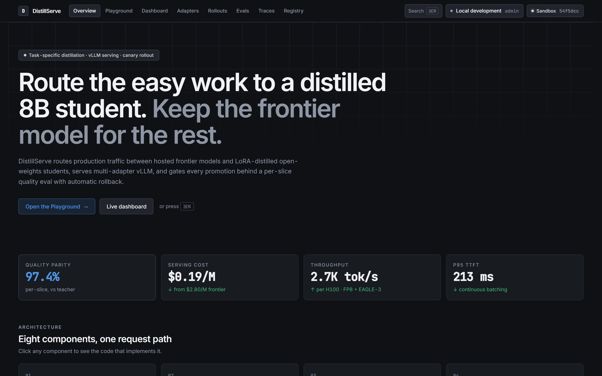

### Live dashboard

SSE tiles, three chart windows, the GPU pool timeline and per-tenant cost. The subtitle
names the telemetry source and the dataset digest, so a screenshot pins to exact data.

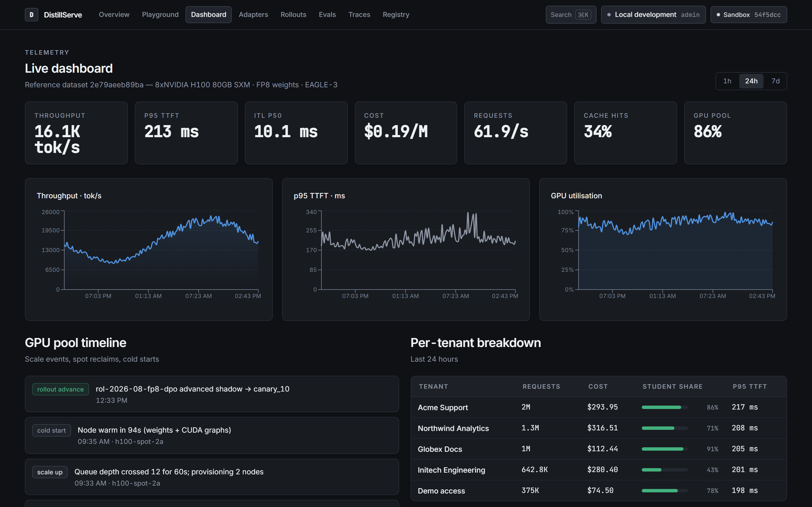

### Eval reports

Per-slice parity against the CI gate, LLM-as-judge win rate with both orders judged, the
adversarial suites and the latency/cost Pareto. Reasoning and code generation are the
slices that fail the gate — which is exactly why the router does not send them to the
student.

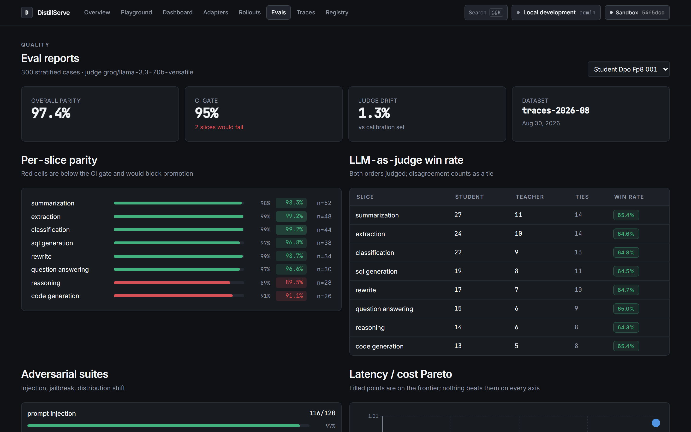

### Canary control

|                                            |                                                        |
| ------------------------------------------ | ------------------------------------------------------ |
| 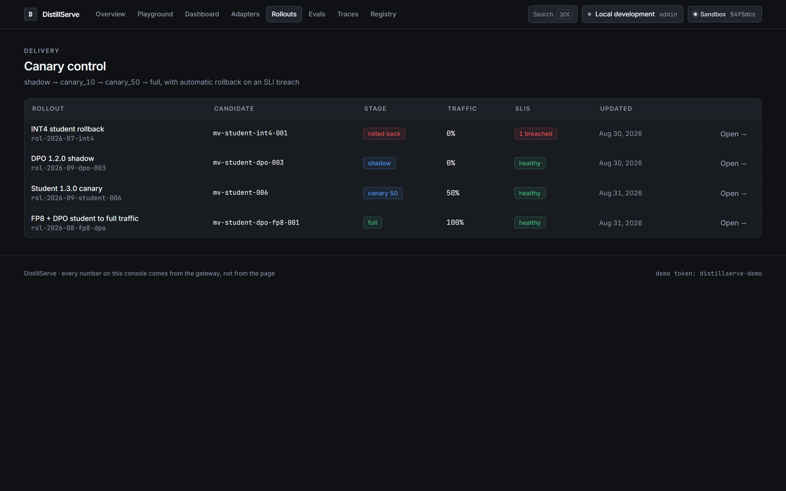 | 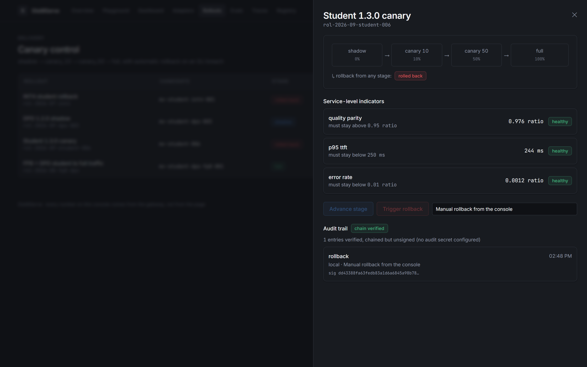 |
| The four rollouts and their SLI health.    | State machine, SLIs, and the hash-chained audit trail. |

`rolled_back` sits off the line rather than at the end of it, because it is reachable
from every stage. Advance is disabled while an SLI is breached.

### Adapters

|                                             |                                                        |
| ------------------------------------------- | ------------------------------------------------------ |
| 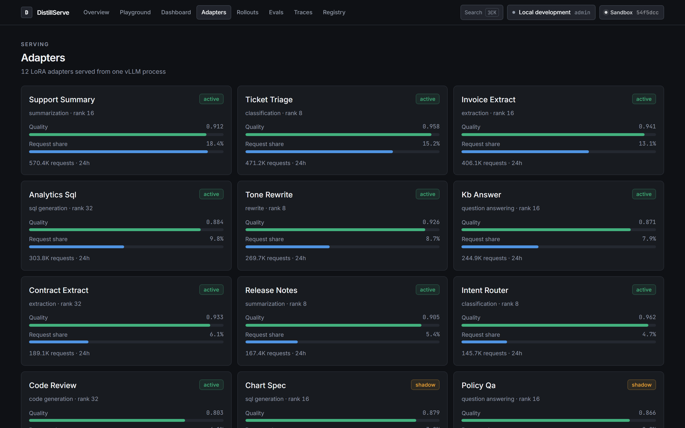  | 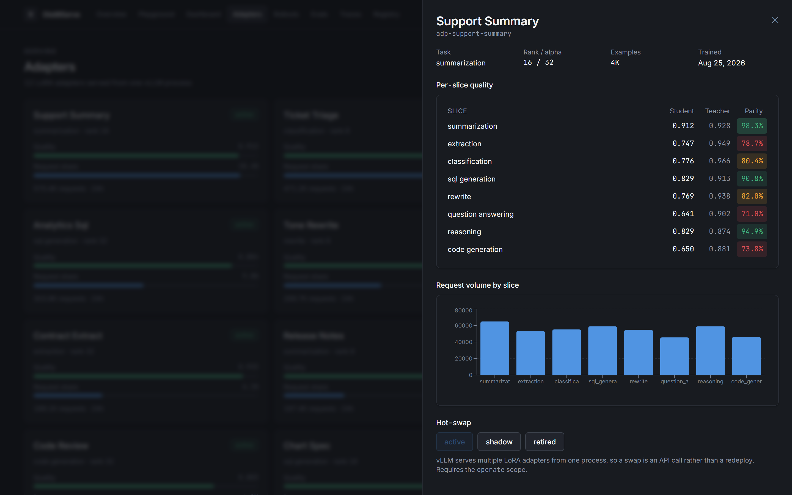 |
| Twelve LoRA adapters from one vLLM process. | Per-slice heatmap, volume, and hot-swap.               |

### Model registry

Fifteen runs, each reproducible from its git SHA, dataset version and seed.

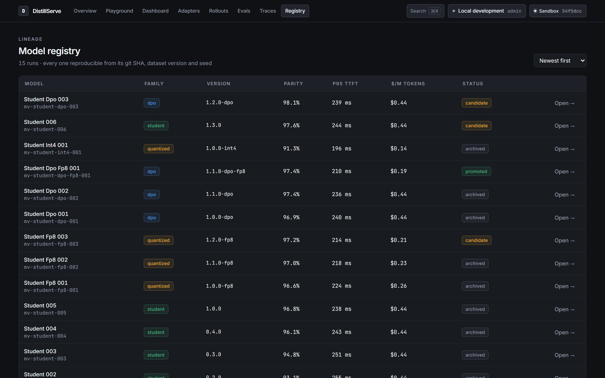

### Playground, Traces, and the ⌘K palette

|                                                          |                                                       |
| -------------------------------------------------------- | ----------------------------------------------------- |
| 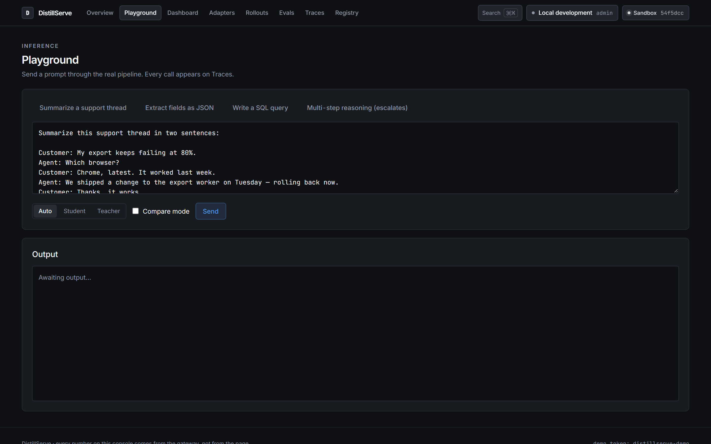           | 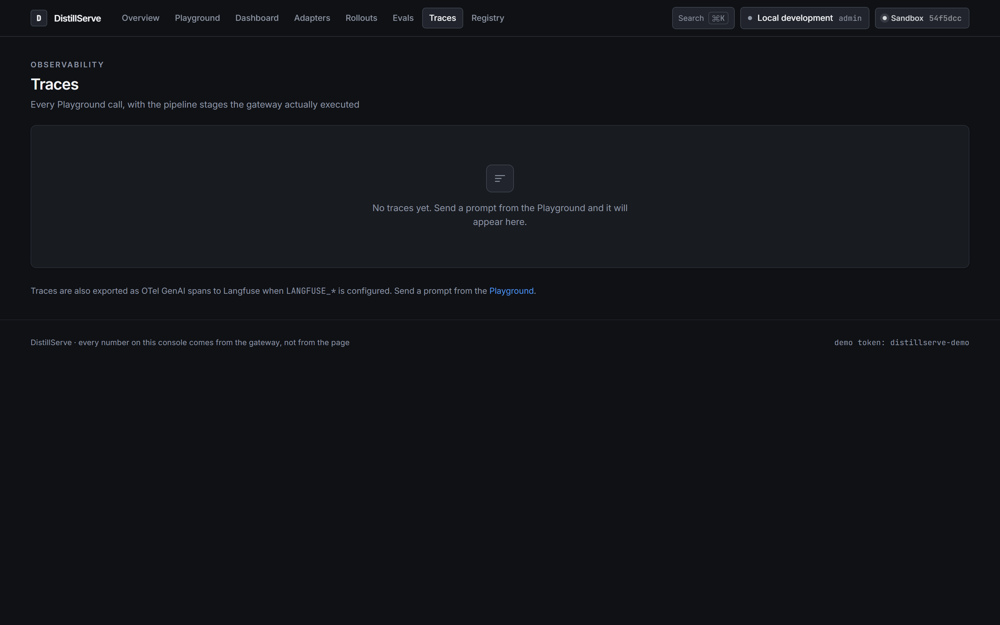                |
| Streaming with browser-measured TTFT and per-call cost.  | The waterfall is the pipeline's real execution order. |
| 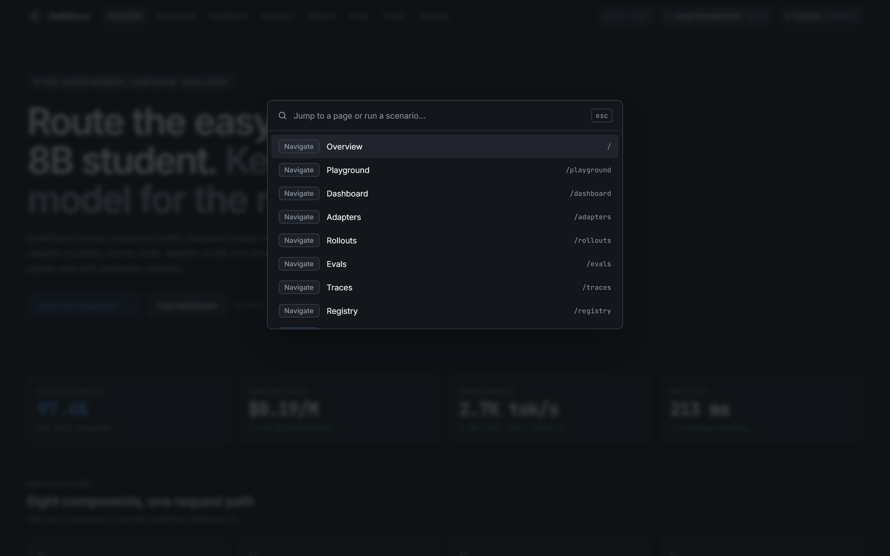 | 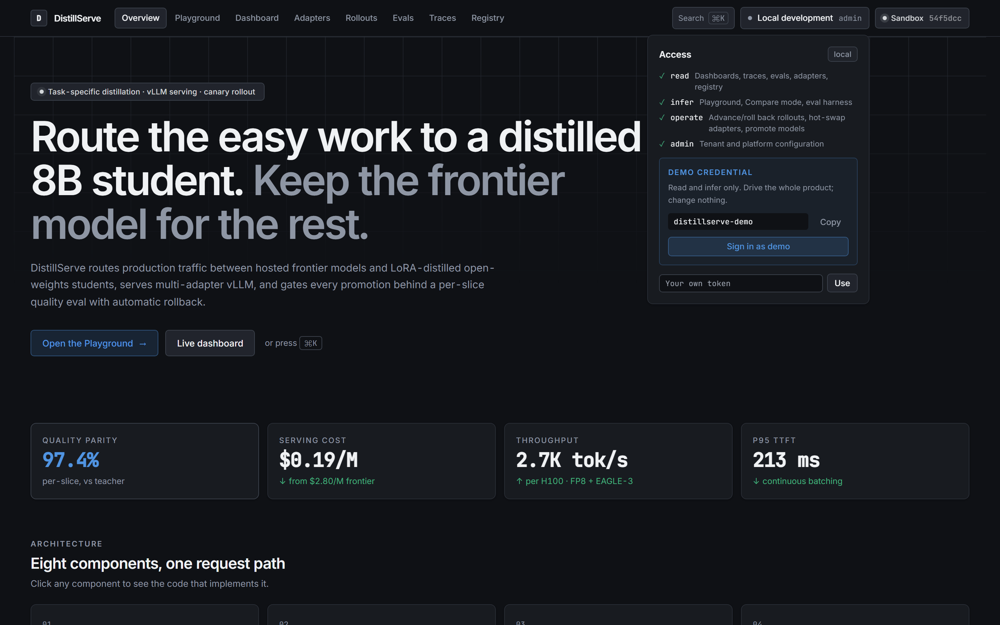      |
| Jump anywhere, or run a canned scenario.                 | Scopes, explained, with the demo credential in reach. |

--------------- | --------------------------------------------------------------------------- |
| **Console** | _set after your first Vercel deploy_ |
| **Gateway** | _set after your first Render deploy_ |
| **Demo access** | Set `DISTILLSERVE_DEMO_TOKEN` and share it — read + infer, no state changes |

The console's eight pages: Overview, Playground, Live Dashboard, Adapters, Canary Control,
Eval Reports, Traces, Model Registry.

---

## Architecture

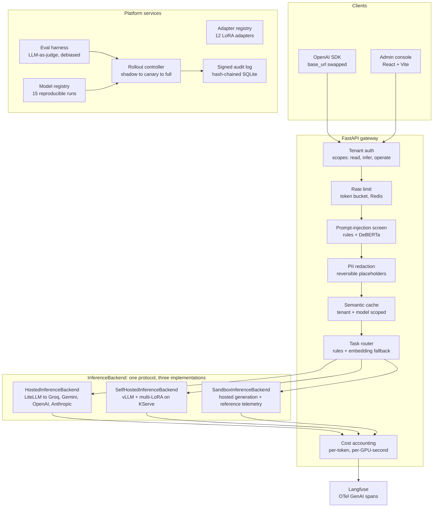

---

## Deployment modes

Three modes, selected by `DISTILLSERVE_MODE`. They are peers, not a ladder: all three share
the same code for routing, semantic cache, prompt-injection defense, PII redaction, OTel
tracing, cost accounting, rate limiting, the eval harness, the rollout state machine and the
console. Only the bound `InferenceBackend` / `TelemetryStream` pair differs — and
[`bootstrap.py`](apps/gateway/src/distillserve_gateway/bootstrap.py) is the only file in the
codebase allowed to branch on the mode.

| Mode          | Generation                                      | `self_hosted` telemetry   | Requires                       |
| ------------- | ----------------------------------------------- | ------------------------- | ------------------------------ |
| `hosted`      | LiteLLM → Groq / Gemini / OpenAI / Anthropic    | reference dataset         | one provider key               |
| `self_hosted` | vLLM OpenAI-compatible endpoint on your GPUs    | live vLLM scrape          | `VLLM_ENDPOINT` + `infra/k8s/` |
| `sandbox`     | LiteLLM → hosted providers (Playground is live) | `ReferenceBenchmarkStore` | one provider key               |

```bash
DISTILLSERVE_MODE=sandbox     # evaluate dashboards, rollouts and evals without GPUs
DISTILLSERVE_MODE=hosted      # route between a hosted teacher and student
DISTILLSERVE_MODE=self_hosted VLLM_ENDPOINT=http://vllm:8000/v1
```

### The reference dataset

`sandbox` streams `self_hosted` telemetry from [`data/reference/`](data/reference/), which is
**generated** from [`generator.yaml`](data/reference/generator.yaml) — never hand-edited. That
matters because the numbers are interdependent: throughput determines cost per token,
utilisation determines how much of that cost is idle, node count follows from queue depth.
Hand-written fixtures drift apart and produce a dashboard that contradicts itself.

Timestamps are offsets from a fixed anchor, projected onto the wall clock at read time. The
dashboard is therefore always moving, tells the same story on every visit, and shows identical
numbers to two people looking at it side by side.

A test asserts the dataset reproduces its own headline figures — median p95 TTFT 210 ms,
median $0.19/M tokens, peak 3,100 tok/s per H100, 0.974 parity — so the README and the
dashboards cannot disagree.

Curve shapes are grounded in published benchmarks, cited in
[`sources/catalog.yaml`](data/reference/sources/catalog.yaml):

- [Inside vLLM: Anatomy of a High-Throughput LLM Inference System](https://vllm.ai/blog/2025-09-05-anatomy-of-vllm) — vLLM, 2025-09-05
- [The State of FP8 KV-Cache and Attention Quantization in vLLM](https://vllm.ai/blog/fp8-kvcache) — vLLM
- [Fly Eagle(3) fly: Faster inference with vLLM & speculative decoding](https://developers.redhat.com/articles/2025/07/01/fly-eagle3-fly-faster-inference-vllm-speculative-decoding) — Red Hat Developer, 2025-07-01

Nothing enters `data/reference/` without a `source_id` in that catalog —
`make reference-refresh` enforces it, and CI runs it with `--check`.

---

## Try it in 5 minutes

```bash
git clone <your-fork> && cd DistillServe
cp .env.example .env          # set any one provider key
docker compose -f infra/docker/docker-compose.yml up --build
```

Console on <http://localhost:5173>, gateway on <http://localhost:8000>. No GPU, no cloud
account, no Kubernetes.

Without Docker:

```bash
make install    # uv sync + pnpm install + pre-commit hooks
make dev        # gateway on :8000, console on :5173
```

Point any OpenAI SDK at it:

```python
from openai import OpenAI

client = OpenAI(base_url="http://localhost:8000/v1", api_key="unused")
response = client.chat.completions.create(
    model=None,  # let the router choose
    messages=[{"role": "user", "content": "Summarize this support thread in two sentences."}],
)
# The response carries a `distillserve` block with the route decision,
# cache outcome, cost and latency breakdown.
```

---

## Providers

Any one key is enough — the teacher/student pair is derived from whichever provider you
configure. Both always come from the same provider: the pair is compared head-to-head on
every eval surface, and mixing vendors would confound the distillation delta with a vendor
difference.

| Provider  | Env var             | Teacher                   | Student                 |
| --------- | ------------------- | ------------------------- | ----------------------- |
| Groq      | `GROQ_API_KEY`      | `llama-3.3-70b-versatile` | `llama-3.1-8b-instant`  |
| Google    | `GEMINI_API_KEY`    | `gemini-2.5-pro`          | `gemini-2.5-flash-lite` |
| OpenAI    | `OPENAI_API_KEY`    | `gpt-4o`                  | `gpt-4o-mini`           |
| Anthropic | `ANTHROPIC_API_KEY` | `claude-sonnet-4-5`       | `claude-haiku-4-5`      |

Prices for all of them are in [`config/prices.yaml`](config/prices.yaml), each citing the page
it came from.

---

## Demo access

Showing the platform to someone should not mean handing over an admin credential or turning
authentication off.

```bash
DISTILLSERVE_AUTH_REQUIRED=true
DISTILLSERVE_DEMO_TOKEN=<a long random string>
DISTILLSERVE_DEMO_RPM=20
```

| Scope     | Demo | Permits                                                           |
| --------- | ---- | ----------------------------------------------------------------- |
| `read`    | ✅   | Dashboards, traces, eval reports, adapters, registry              |
| `infer`   | ✅   | Playground, Compare mode, eval harness                            |
| `operate` | ❌   | Advance/roll back a rollout, hot-swap an adapter, promote a model |
| `admin`   | ❌   | Tenant and platform configuration                                 |

A visitor can drive the entire product and cannot change its state. Tokens are stored as
SHA-256 digests and compared in constant time; the token never appears in a config file, a log
line or an API response. Routes ask for a _scope_, never a role, so adding a role later is
configuration rather than an edit to every endpoint.

---

## Design decisions

**Generated reference dataset over hand-written fixtures.** The numbers are interdependent.
Hand-editing lets them drift, and a dashboard whose figures contradict each other is worse
than no dashboard.

**LiteLLM as a thin adapter over LangChain or raw provider SDKs.** One normalised streaming
chunk shape across four providers, without inheriting a framework's control flow. DistillServe
keeps routing, retries, cost and tracing.

**OTel GenAI conventions → Langfuse over OTLP, not the Langfuse SDK.** Vendor-neutral spans:
the same instrumentation fans out to a collector, Tempo or Honeycomb by changing one endpoint,
and the attribute names are a public spec rather than a private schema.

**Token bucket over fixed-window rate limiting.** A fixed window lets a tenant spend its whole
minute in the last second and again in the first — a 2× burst against the upstream provider
exactly when you are trying to stay under _its_ limit.

**Reversible PII redaction over irreversible masking.** A model asked to "write a reply to this
customer" must still produce a usable reply. Irreversible masking breaks the product, which is
why those layers get switched off in production.

**Zustand + TanStack Query over Redux Toolkit.** Almost all state here is server state, which
TanStack Query owns. What remains is a handful of UI toggles; RTK's boilerplate buys nothing at
that size.

**SQLite over Postgres for the registry and audit log.** Small, read-mostly data whose value is
being _present_. A registry you must provision a database for is a registry that does not exist
in month one.

**Escalate on router uncertainty over defaulting to the cheap model.** A mis-routed hard prompt
costs quality — the thing distillation exists to protect. A mis-routed easy prompt costs a
fraction of a cent.

---

## What is implemented

| Area               | Detail                                                                                                                 |
| ------------------ | ---------------------------------------------------------------------------------------------------------------------- |
| **Gateway**        | OpenAI-compatible `/v1/chat/completions`; streaming and buffered share one pipeline so they cannot diverge             |
| **Routing**        | Rules classifier with an embedding fallback slot; escalates on low confidence or an undistilled task                   |
| **Semantic cache** | Tenant- and model-scoped; 0.95 threshold; a hit is billed at zero                                                      |
| **Guardrails**     | Weighted injection signals with block/flag/allow; reversible PII redaction with Luhn and SSA validation                |
| **Rate limits**    | Per-tenant token bucket; Redis Lua for atomicity across replicas, in-memory fallback that reports `distributed=false`  |
| **Degradation**    | An upstream 429 serves from cache and stamps `fallback_reason` on the trace                                            |
| **Cost**           | Per-token for hosted, per-GPU-second for self-hosted, reduced to one comparable `total_usd`; idle GPU-seconds included |
| **Rollouts**       | Reconciliation loop; advance refused while an SLI is breached; rollback jumps straight to baseline                     |
| **Audit**          | Hash-chained HMAC — a tampered or deleted row breaks the chain, and an unsigned log says so                            |
| **Evals**          | Pairwise LLM-as-judge run in both orders; disagreement recorded as a tie; pinned judge with drift monitoring           |
| **Contracts**      | Pydantic models are the only definition; TypeScript is generated and CI fails on drift                                 |

---

## Make targets

| Target                   | Does                                                          |
| ------------------------ | ------------------------------------------------------------- |
| `make install`           | Sync the Python workspace, install JS deps, install git hooks |
| `make dev`               | Gateway and console together                                  |
| `make test`              | `pytest` + `vitest`                                           |
| `make lint`              | `ruff` + `black --check`, ESLint + Prettier                   |
| `make typecheck`         | `mypy --strict` + `tsc --noEmit`                              |
| `make schemas`           | Regenerate TypeScript from the Pydantic models                |
| `make reference-refresh` | Rebuild the reference dataset and its content-hashed manifest |
| `make deploy-check`      | Probe a deployed gateway and print a green/red summary        |

---

## Deploying

**Backend → Render.** [`infra/render.yaml`](infra/render.yaml) is a blueprint: point Render at
the repo and set `GROQ_API_KEY` (or another provider), `REDIS_URL`, `LANGFUSE_*` and
`DISTILLSERVE_DEMO_TOKEN`. Health check is `/healthz`.

**Frontend → Vercel.** [`infra/vercel.json`](infra/vercel.json) builds `apps/web` and rewrites
`/api/*` to the Render service, so the console is same-origin and CORS is a deployment concern
rather than app logic. Set the rewrite destination to your gateway URL.

**Redis → Upstash.** The free tier covers the semantic cache and rate-limit buckets.

**Langfuse → cloud.** Set `LANGFUSE_PUBLIC_KEY` and `LANGFUSE_SECRET_KEY`; without them the
gateway traces locally and exports nothing, and `/readyz` reports `degraded` rather than
failing.

```bash
make deploy-check DEPLOY_CHECK_URL=https://your-gateway.onrender.com
```

Required secrets: one provider key, `REDIS_URL`, `LANGFUSE_PUBLIC_KEY`,
`LANGFUSE_SECRET_KEY`, `DISTILLSERVE_AUDIT_SECRET`, `DISTILLSERVE_DEMO_TOKEN`. All documented
in [`.env.example`](.env.example).

---

## Repository layout

```
distillserve/
  apps/
    web/                  React 18 + Vite + TS console, 8 pages
    gateway/              FastAPI gateway
      backends/           hosted, self_hosted, sandbox + telemetry streams
      guardrails/         injection screen, PII redaction
      platform/           rollouts, registry, evals
      reference/          ReferenceBenchmarkStore
  packages/
    schemas/              Pydantic models — the only definition of every shape
    otel/                 OTel + structlog, GenAI attribute vocabulary
  config/prices.yaml      Price sheet, per-token and per-GPU-second
  data/reference/         Generated benchmark dataset + provenance catalog
  infra/{docker,k8s}/     Compose, Dockerfiles, KServe/Karpenter manifests
  scripts/                deploy check, TS generation, dataset build
```

---

## Roadmap

The next milestone is **closing the loop from production traces back to a trained adapter**.
Today the platform routes, evaluates and rolls out; the distillation itself happens outside it.

1. **Trace mining** — select high-value production traces by task slice and teacher cost, and
   assemble a training set with the deduplication and PII guarantees the gateway already has.
2. **Training jobs on the same cluster** — a LoRA/QLoRA job submitted from the registry,
   sharing the Karpenter pool with serving and preempted by it.
3. **Automatic promotion proposals** — when a newly trained adapter clears the CI gate on every
   slice, the controller opens a shadow rollout rather than waiting for a human.
4. **Multi-teacher distillation** — route training-signal generation across providers and pick
   per-slice, since no single frontier model is best at every task.
5. **Per-adapter speculative decoding** — EAGLE-3 draft heads trained alongside each LoRA,
   which is where the next large ITL win is.

---

## Development

- **Python**: `ruff` (with `D`, `ANN`, `S`) + `black` + `mypy --strict`.
- **TypeScript**: ESLint `strictTypeChecked` + Prettier; `noUncheckedIndexedAccess` and
  `exactOptionalPropertyTypes` on.
- **Contracts**: shapes defined once, in `packages/schemas`. CI runs
  `generate_ts_types.py --check`.
- **Provenance**: nothing enters `data/reference/` without a cited source.
- **CI**: python · web · gateway smoke · Playwright end-to-end · pre-commit over all files.

- [`docs/walkthrough.md`](docs/walkthrough.md) — a two-minute click-through of the console.
- [`docs/interview-guide.md`](docs/interview-guide.md) — architecture deep-dive, design
  rationale for every component, and the deployment runbook.
